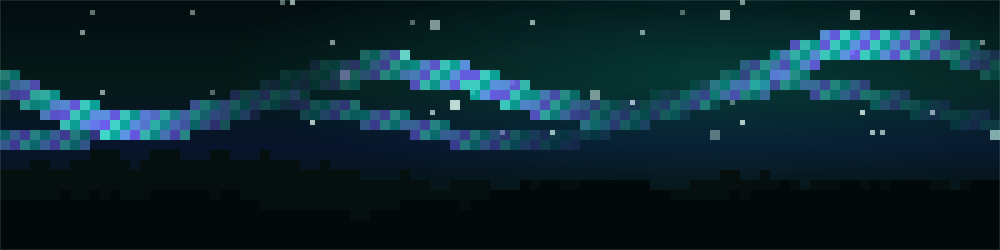

<div align="center">



# Forge Range

### The training range for the human-led, AI-assisted coding interview

**35 days. 35 failing test suites. One habit: never ship a line you can't defend.**

[](https://kenny2077.github.io/Aurora-Forge/)
[](./MONTH_PLAN.md)
[](#curriculum)
[](#curriculum)
[](./LICENSE)

**[🎓 Fundamentals exam](https://kenny2077.github.io/Aurora-Forge/fundamentals.html)** · **[🐛 Real-world problems](https://kenny2077.github.io/Aurora-Forge/swe.html)** · **[▶ Coding days](https://kenny2077.github.io/Aurora-Forge/)** · **[📋 Plan](./MONTH_PLAN.md)** · **[🔎 Sources](./SOURCES.md)**

</div>

> [!IMPORTANT]
> **The coding round is being rebuilt while everyone is still prepping for the old one.**
>
> Companies including **Meta** are piloting or rolling out AI-enabled coding interviews, and
> **Google** has reportedly tested Gemini-assisted formats for selected SWE interviews. Where the
> format has landed it is **human-led, AI-assisted**: you get an assistant, and you are graded on
> *judgment* — scoping an ambiguous problem, reading code you didn't write, catching what the model
> got subtly wrong, and owning the result.
>
> LeetCode doesn't train that. **This does** — 35 runnable days, each a failing test suite you make
> pass with AI. ([what this is based on →](./SOURCES.md))

## Two layers

The product is two layers, entry-level (Google **L3**) first:

| | Layer | What it is |
|---|---|---|
| **1** | **[Fundamentals of Agentic Coding](https://kenny2077.github.io/Aurora-Forge/fundamentals.html)** — *know the game* | A scored MCQ exam: context windows & compaction, prompting, tool calls / harness / MCP, prompt injection, reasoning-effort tiers, and output validation. Objective and quantifiable. |
| **2** | **Real-world code** — *play the game* | [SWE-bench-style problems](https://kenny2077.github.io/Aurora-Forge/swe.html): read a real bug, find the **core issue**, pick the **surgical fix** — plus the 35 guided coding days below and the terminal mock. |

## Why

Where this format has landed, the round stopped testing recall and started testing how you **drive
the model**. Every day here is a ticket-style brief with realistic starter code, a **failing test
suite**, and a spoiler-free mock. It's not more algorithms — it's the skills the new round actually
scores: ambiguous scoping, output validation, test strength, testability, security-mindedness, and
agent-infra engineering.

## Quickstart

```bash
git clone https://github.com/kenny2077/Aurora-Forge.git
cd Aurora-Forge

# Python days — needs python3 + pytest
cd Day6_Concurrency_Race && python3 -m pytest -q     # watch it fail, then fix it with AI

# TypeScript days — needs Node 24+ (runs .ts natively, no build)
cd Day7_CSV_Tokenizer_TS && node --test
```

> [!TIP]
> Every day's starter **fails on purpose.** Your job is to make the suite green with an AI
> assistant — and never keep a line you can't explain. Log your prompts and how you verified the
> output in each day's `AI_LOG.md`; that reflection is what turns reps into skill.

## The interactive mock

Drive any day like a live round — you get only the vague prompt, and you *ask* for clarifications
and hints:

```console
$ python3 interview.py Day2_AmbiguousSpec

Interviewer: Given text and a width, return how many lines you'd need to write it. Go.
you> ask does a newline force a hard break?
Interviewer: Yes — a newline is a hard break. And a word longer than the width?
you> hint
Hint 1: List every decision the one-sentence ask left open before writing code.
you> test        # runs the day's suite from inside the session
you> done        # debrief + self-score, written to AI_LOG.md
```

The same flow lives in the browser — the **[live site](https://kenny2077.github.io/Aurora-Forge/)**
lets you filter by week, language and difficulty, open any day as a mock, and track your progress
(saved locally).

## Curriculum

Layer 2's guided hands-on track — 35 days, each a failing suite you make pass with AI:

| Week | Theme | Days | Focus |
|:---:|---|:---:|---|
| 1 | **Foundations** | 01–05 | Comprehend · scope · refactor · multi-file feature · mock PR |
| 2 | **Debugging & comprehension** | 06–10 | Concurrency race · CSV tokenizer · state machine · API contract · hash join |
| 3 | **AI-fluency & validation** | 11–15 | Prompt→spec · validate AI output · mutation testing · testability · security |
| 4 | **Systems building blocks** | 16–20 | Rate limiter · LRU+TTL · cursor pagination · event bus · CLI parsing |
| 5 | **Algorithms in context** | 21–25 | Sliding-window max · meeting rooms · topo sort · trie autocomplete · running median |
| 6 | **Applied AI-agent engineering** | 26–30 | Tool dispatch · circuit breaker · context trimming · stream parsing · RAG chunking |
| 7 | **Capstones** | 31–35 | URL shortener · cross-language contract · god-module refactor · ambiguous scoping · LRU+TTL boss |

Per-day levels and verification status live in **[MONTH_PLAN.md](./MONTH_PLAN.md)**.

## Repository layout

```text
.
├── Day01…Day35_*/           # one folder per exercise
│   ├── README.md            #   the ticket + workflow
│   ├── <starter>.py|.ts     #   code with the planted bug / stub
│   ├── test_*.py | *.test.ts#   the failing suite you make pass
│   ├── interview.json       #   drives the mock (prompt, clarifications, hints)
│   └── AI_LOG.md            #   your prompt + verification log
├── interview.py             # the terminal mock runner
├── docs/index.html          # the coding-days web app (GitHub Pages)
├── docs/fundamentals.html   # Layer 1 — fundamentals exam
├── docs/swe.html            # Layer 2 — SWE-bench-style problems
├── assets/banner.svg        # the pixel-art hero
├── MONTH_PLAN.md            # curriculum + verification status
└── SOURCES.md               # reporting behind the program's design
```

## Quality bar

Every day holds one invariant, verified across the whole set:

> **The starter fails for its stated reason, and a correct surgical solution passes.**

- **Days 1–20** were reviewed by an automated critic and gated to **≥ 8/10** on difficulty
  calibration, solvability, and learning value.
- **Days 21–35** are self-verified to the same standard — 35/35 starters fail as intended; every
  reference solution passes.
- Timing and concurrency tests are **deterministic** (barriers, injected clocks, wide margins) — no
  flaky suites, no hangs.

## License

[MIT](./LICENSE). Use it, fork it, share it with anyone prepping for the new round.

<div align="center"><sub>Aurora Forge Lab · a training range, not a leaderboard 🛰️</sub></div>
